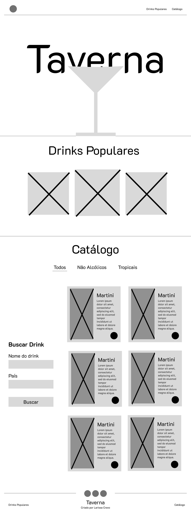
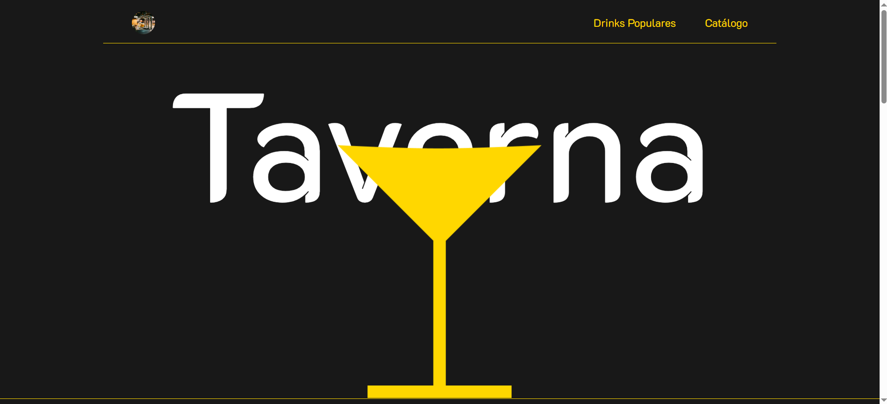

# Trabalho Prático - Semana 04

Dessa vez, vamos escolher uma proposta de projeto para trabalhar.

Nessa atividade, você deverá montar a página inicial do projeto escolhido, a organização do HTML aplicando semântica correta e uso aprimorado do CSS. Leia o enunciado completo no Canvas para mais detalhes.

**IMPORTANTE:** Você deve trabalhar e alterar apenas arquivos dentro da pasta **`public`**. Deixe todos os demais arquivos e pastas desse repositório inalterados. **PRESTE MUITA ATENÇÃO NISSO.**

## Informações Gerais

- Nome: Larissa Cravo Carvalho Câmara Santos
- Matricula: 911467
- Proposta de projeto escolhida: Taverna - Site para catálogo de drinks
- Breve descrição sobre seu projeto: O projeto Taverna consiste em um site temático voltado para a descoberta de drinks típicos de diferentes países ao redor do mundo. A plataforma apresenta bebidas populares e um catálogo organizado com cards que exibem imagem, descrição e país de origem de cada drink. O usuário pode explorar a diversidade cultural das bebidas, além de utilizar filtros e busca para encontrar drinks por nome ou país.

## Print do(s) wireframe(s) criado

## Print da home-page criada

